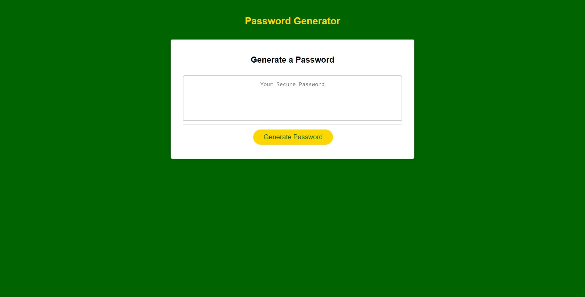

# Random Password Generator

## Purpose
Built as an exersise to learn JavaScript, this application will generate a random password after prompting a user to choose their criteria. 

Criteria options are:
Length
Lowercase letters
Uppercase letters
Numbers
Special Characters

## Built With
* HTML
* CSS
* JavaScript

## Screenshots

## deployed Application
https://cbiertz.github.io/password-gen/

## Contribution
Made with ❤️ by Chris Biertzer. Starter code provided by UW-Madison Coding Bootcamp.